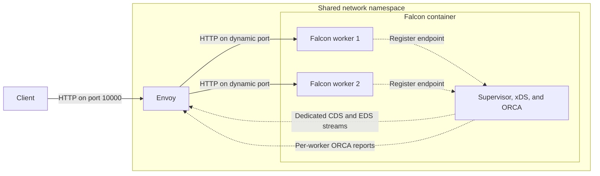

# Dynamic Clusters with Envoy

This guide explains how to run Falcon workers with independently bound endpoints, publish them dynamically using xDS, and balance requests according to their current load using ORCA.

## When to Use a Cluster

A regular {ruby Falcon::Service::Server} binds one listener and shares it with every worker. This is the simplest design when Falcon accepts connections directly or sits behind a load balancer that targets one stable address.

{ruby Falcon::Service::Cluster} instead gives each worker its own listener. Use it when an external load balancer needs to address, monitor, and remove workers individually. Because workers may bind ephemeral ports or Unix-domain sockets, the load balancer needs a dynamic source of viable endpoints rather than a static address list.

| Service | Listener ownership | Upstream discovery |
| --- | --- | --- |
| `Falcon::Service::Server` | One listener shared by all workers | One stable address |
| `Falcon::Service::Cluster` | One listener per worker | Dynamic worker endpoints |

## Architecture

Each cluster worker can bind to `localhost` with port `0`, allowing the operating system to assign an available port. Falcon describes the bound resource with a {ruby Falcon::Listener}, including its name, scheme, supported protocols, and concrete addresses.

The worker registers that listener with `async-service-supervisor-envoy`. The supervisor publishes the current workers and load-balancing policy through an xDS control plane. Envoy uses Cluster Discovery Service (CDS) and Endpoint Discovery Service (EDS) updates to maintain the upstream cluster.

The supervisor also samples each worker's CPU utilization and request counter. It exposes those measurements using out-of-band Open Request Cost Aggregation (ORCA), which lets Envoy's client-side weighted-round-robin policy direct more requests to workers with more available capacity. This avoids coupling connection acceptance to a process-local token limiter while still responding to CPU-heavy work.

Requests arrive at Envoy's stable listener. Envoy selects one of the discovered worker endpoints and forwards the request to it:



## Configuration

Add Falcon and the Envoy supervisor integration to your `gems.rb`:

```ruby
gem "falcon", "~> 0.56.0"
gem "async-service-supervisor-envoy", "~> 0.5"
```

Define a Falcon cluster service and an accompanying supervisor in `falcon.rb`:

```ruby
#!/usr/bin/env async-service
# frozen_string_literal: true

require "async/service/supervisor"
require "async/service/supervisor/envoy"
require "falcon/environment/cluster"

service "cluster" do
	include Falcon::Environment::Cluster
	include Async::Service::Supervisor::Envoy::Supervised
	
	count 2
	
	def url
		"http://localhost:0"
	end
	
	middleware do
		application = proc do |_env|
			body = "Hello from worker #{Process.pid}!\n"
			
			[200, {
				"content-type" => "text/plain",
				"content-length" => body.bytesize.to_s,
			}, [body]]
		end
		
		Falcon::Server.middleware(application, cache: false)
	end
end

service "supervisor" do
	include Async::Service::Supervisor::Environment
	
	monitors do
		utilization_monitor = Async::Service::Supervisor::UtilizationMonitor.new
		
		[
			utilization_monitor,
			Async::Service::Supervisor::Envoy::Monitor.new(
				bind: "http://[::]:18000",
				orca: true,
				utilization_monitor: utilization_monitor,
			),
		]
	end
end
```

The Falcon service name becomes the listener name, so the corresponding Envoy cluster uses `cluster` as its service name. Configure Envoy to receive cluster and endpoint updates from the supervisor:

```yaml
node:
  id: falcon-cluster
  cluster: falcon-cluster

dynamic_resources:
  cds_config:
    resource_api_version: V3
    api_config_source:
      api_type: GRPC
      transport_api_version: V3
      grpc_services:
        - envoy_grpc:
            cluster_name: xds_cluster

static_resources:
  listeners:
    - name: listener_http
      address:
        socket_address:
          address: 0.0.0.0
          port_value: 10000
      filter_chains:
        - filters:
            - name: envoy.filters.network.http_connection_manager
              typed_config:
                "@type": type.googleapis.com/envoy.extensions.filters.network.http_connection_manager.v3.HttpConnectionManager
                stat_prefix: ingress_http
                route_config:
                  name: local_route
                  validate_clusters: false
                  virtual_hosts:
                    - name: falcon
                      domains: ["*"]
                      routes:
                        - match:
                            prefix: "/"
                          route:
                            cluster: cluster
                http_filters:
                  - name: envoy.filters.http.router
                    typed_config:
                      "@type": type.googleapis.com/envoy.extensions.filters.http.router.v3.Router

  clusters:
    - name: xds_cluster
      connect_timeout: 1s
      type: STATIC
      load_assignment:
        cluster_name: xds_cluster
        endpoints:
          - lb_endpoints:
              - endpoint:
                  address:
                    socket_address:
                      address: "::1"
                      port_value: 18000
      typed_extension_protocol_options:
        envoy.extensions.upstreams.http.v3.HttpProtocolOptions:
          "@type": type.googleapis.com/envoy.extensions.upstreams.http.v3.HttpProtocolOptions
          explicit_http_config:
            http2_protocol_options: {}
```

The `xds_cluster` connection uses HTTP/2 because CDS and EDS are served over gRPC. The supervisor serves dedicated CDS and EDS streams together with ORCA on port `18000`; Envoy uses that as an alternative to each worker's HTTP port when opening ORCA streams. Envoy 1.39 or later is required for this alternative reporting-port configuration.

## Worker Registration

When each worker starts:

1. Falcon binds the worker to an available loopback port.
2. The worker registers its concrete addresses and supported protocols with the supervisor.
3. The supervisor's Envoy monitor publishes the cluster policy and current worker endpoints as CDS and EDS resources.
4. Envoy receives the resources over dedicated CDS and EDS streams and updates its upstream cluster.
5. The supervisor samples worker CPU time and request totals, then streams the current load reports to Envoy using ORCA.

The first processor and request samples establish baselines. Load-aware weights become available after the next sampling interval. If a report is temporarily unavailable, Envoy retains its normal policy fallback rather than making the worker unreachable.

The listener preserves all addresses returned by the bound endpoint. This allows the same interface to describe IP sockets, Unix-domain sockets, and endpoints with additional addresses.

## Worker Restarts

If a worker exits, its supervisor connection closes and the monitor removes both its endpoint and ORCA report. Falcon restarts the worker, which binds a new available port and registers it. The monitor then publishes another update, and Envoy receives both changes over its existing EDS stream without polling or restarting.

This lifecycle is important when ports are ephemeral or a directory may contain stale Unix-domain socket paths: consumers should use the supervisor's current endpoint state as the source of truth.

## Network Topology

Falcon and Envoy can run in the same network namespace, allowing workers to bind to loopback addresses while remaining reachable by Envoy. With Docker Compose, `network_mode: service:falcon` gives the Envoy service access to Falcon's network namespace, so loopback addresses refer to the same interface for both processes.

The configuration binds the supervisor endpoint to the IPv6 wildcard address because `localhost` worker endpoints use IPv6 in the container. Envoy connects to CDS and EDS through `::1`; for each ORCA stream it uses the worker's address with the configured supervisor port `18000`. The supervisor listener must therefore be reachable using the same address family as every published worker endpoint.

Without a shared network namespace, Envoy cannot connect to worker endpoints bound to Falcon's loopback interface. In a different deployment topology, bind workers to an interface that Envoy can reach and apply the appropriate network access controls.
