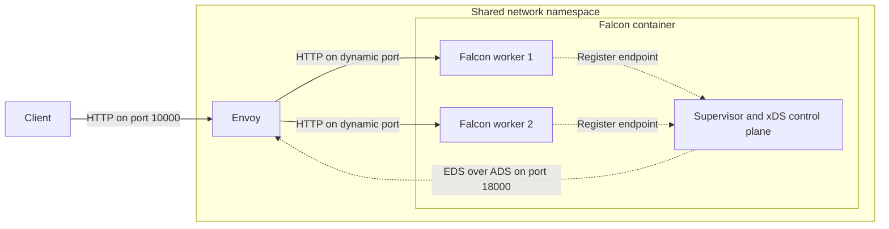

# Cluster with Envoy

This example runs a two-worker Falcon cluster behind Envoy. Each worker binds to `localhost` with port `0`, allowing the operating system to assign an available port. Falcon publishes the concrete worker addresses to Envoy through the supervisor's xDS control plane.

Docker Compose runs Falcon and Envoy in the same network namespace. This allows the workers to remain bound to loopback addresses while Envoy connects to their dynamically assigned ports. Envoy exposes a fixed HTTP listener on port 10000 and distributes requests across the workers.

## How It Works

The `falcon` container runs both the Falcon cluster and its supervisor. When each worker starts:

1. Falcon binds the worker to an available loopback port.
2. The worker registers its concrete address and supported protocols with the supervisor.
3. The supervisor's Envoy monitor publishes the current worker addresses as an Endpoint Discovery Service (EDS) resource.
4. Envoy receives the resource over its Aggregated Discovery Service (ADS) connection and uses those addresses for the `cluster` upstream.

Requests arrive at Envoy's listener on port 10000. Envoy selects one of the discovered worker endpoints and forwards the request to it:



The `envoy` service uses `network_mode: service:falcon`, so it shares the Falcon container's network namespace. Consequently, `127.0.0.1` and `localhost` refer to the same loopback interface for both processes. Without the shared namespace, Envoy could not connect to the workers' loopback addresses.

If a worker exits, its supervisor connection closes and the monitor publishes an EDS update without that endpoint. Falcon restarts the worker, which binds a new available port and registers it; the monitor then publishes another update. Envoy receives both changes over its existing ADS stream, without polling or restarting.

## Usage

Build and start Falcon and Envoy:

```shell
$ docker compose up --build --detach
```

Run the client through Compose:

```shell
$ docker compose run --rm client
Hello from worker 12!
Hello from worker 13!
```

The client waits for Envoy and confirms that requests reach both workers.

Stop and remove the containers:

```shell
$ docker compose down
```
