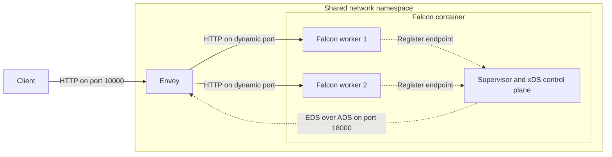

# Dynamic Clusters with Envoy

This guide explains how to run Falcon workers with independently bound endpoints and publish them dynamically to Envoy using xDS.

## When to Use a Cluster

A regular {ruby Falcon::Service::Server} binds one listener and shares it with every worker. This is the simplest design when Falcon accepts connections directly or sits behind a load balancer that targets one stable address.

{ruby Falcon::Service::Cluster} instead gives each worker its own listener. Use it when an external load balancer needs to address, monitor, and remove workers individually. Because workers may bind ephemeral ports or Unix-domain sockets, the load balancer needs a dynamic source of viable endpoints rather than a static address list.

| Service | Listener ownership | Upstream discovery |
| --- | --- | --- |
| `Falcon::Service::Server` | One listener shared by all workers | One stable address |
| `Falcon::Service::Cluster` | One listener per worker | Dynamic worker endpoints |

## Architecture

Each cluster worker can bind to `localhost` with port `0`, allowing the operating system to assign an available port. Falcon describes the bound resource with a {ruby Falcon::Listener}, including its name, scheme, supported protocols, and concrete addresses.

The worker registers that listener with `async-service-supervisor-envoy`. The supervisor publishes the current workers through an xDS control plane, and Envoy uses Endpoint Discovery Service (EDS) updates to maintain the upstream cluster.

Requests arrive at Envoy's stable listener. Envoy selects one of the discovered worker endpoints and forwards the request to it:

## Worker Registration

When each worker starts:

1. Falcon binds the worker to an available loopback port.
2. The worker registers its concrete addresses and supported protocols with the supervisor.
3. The supervisor's Envoy monitor publishes the current worker endpoints as an EDS resource.
4. Envoy receives the resource over its Aggregated Discovery Service (ADS) connection and updates its upstream cluster.

The listener preserves all addresses returned by the bound endpoint. This allows the same interface to describe IP sockets, Unix-domain sockets, and endpoints with additional addresses.

## Worker Restarts

If a worker exits, its supervisor connection closes and the monitor publishes an EDS update without that endpoint. Falcon restarts the worker, which binds a new available port and registers it. The monitor then publishes another update, and Envoy receives both changes over its existing ADS stream without polling or restarting.

This lifecycle is important when ports are ephemeral or a directory may contain stale Unix-domain socket paths: consumers should use the supervisor's current endpoint state as the source of truth.

## Network Topology

Falcon and Envoy can run in the same network namespace, allowing workers to bind to loopback addresses while remaining reachable by Envoy. With Docker Compose, `network_mode: service:falcon` gives the Envoy service access to Falcon's network namespace, so `127.0.0.1` and `localhost` refer to the same loopback interface for both processes.

Without a shared network namespace, Envoy cannot connect to worker endpoints bound to Falcon's loopback interface. In a different deployment topology, bind workers to an interface that Envoy can reach and apply the appropriate network access controls.

## Complete Example

See the [cluster example](https://github.com/socketry/falcon/tree/main/examples/cluster) for a Docker Compose configuration containing Falcon, its supervisor and xDS control plane, Envoy, and an Async HTTP client that confirms requests reach both workers.
